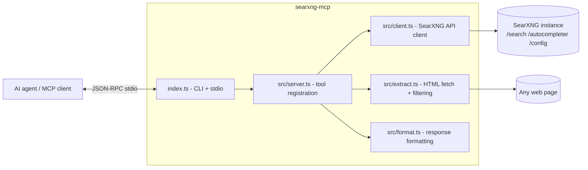

# SPEC — searxng-mcp

Complete specification of the `searxng-mcp` MCP server: goals, architecture, tool contracts,
extraction/filtering behavior, error handling, packaging and testing.

- **Package**: `searxng-mcp`
- **Version**: 1.0.0
- **Runtime**: Bun (development) / Node.js >= 18 (distribution target)
- **Protocol**: MCP over stdio (`@modelcontextprotocol/sdk` ^1.32)
- **License**: MIT

---

## 1. Vision & goals

Give any MCP-capable AI agent private, configurable web research:

1. **Search through the user's own SearXNG instance** — metasearch over many engines with no
   third-party profiling; the agent never talks to Google/Bing directly.
2. **Single configuration knob** — the SearXNG base URL (env var or CLI flag, default
   `http://localhost:8888`). Nothing else to configure.
3. **Agent-grade output** — compact structured text instead of raw API JSON or HTML pages.
4. **Content extraction with structural filtering** — after finding a page, the agent can fetch
   it and keep only the substance: headers, footers, navigation menus, sidebars, cookie banners,
   ads and comment sections are removed by default; every removal is reported and reversible
   per call via `include_*` options.
5. **Global installability** — `bun install -g`, `npm install -g` or `npx`, straight from GitHub
   or npm, running the committed self-contained `dist/index.js` bundle.

## 2. Non-goals

- No proxying of search *through* the MCP for non-SearXNG engines (the instance is the source).
- No JavaScript rendering (headless browser). Pages that need JS are reported as such.
- No authentication layer of its own: SearXNG has none; instance protection (limiter, network
  position) is the operator's responsibility.
- No persistent caching or rate limiting client-side (v1).
- No MCP resources/prompts — tools only (v1).

## 3. Architecture



| Module | Responsibility |
|--------|----------------|
| `index.ts` | CLI parsing (`--url`, `--help`, `--version`), config resolution, stdio wiring. Logs to **stderr only** (stdout is the MCP channel). |
| `src/config.ts` | Argument/env parsing, base-URL normalization and validation. |
| `src/client.ts` | Typed client for the SearXNG JSON API with injectable `fetch`, timeouts, and actionable error messages. |
| `src/extract.ts` | Page fetch (size/type guards), DOM cleaning (chrome + noise removal), main-content detection, text rendering. |
| `src/format.ts` | Rendering of SearXNG responses into markdown-ish text; domain filtering of results. |
| `src/server.ts` | `McpServer` construction and registration of the 7 tools (Zod input schemas, tool annotations). |
| `src/types.ts` | TypeScript types mirroring the SearXNG JSON API. |

Dependencies: `@modelcontextprotocol/sdk`, `zod` (v4, aligned with the SDK), `node-html-parser`
(lightweight HTML DOM subset). No HTTP framework, no cheerio/jsdom.

## 4. Configuration

Resolution order for the instance URL:

1. `--url <url>` / `-u <url>` CLI flag
2. `SEARXNG_URL` environment variable
3. Default `http://localhost:8888`

Normalization rules (`normalizeBaseUrl`):

- trimmed of surrounding whitespace;
- must parse as an absolute URL with `http:`/`https:` protocol (else fatal config error);
- trailing slashes stripped; a trailing `/search` (pasted search URL) stripped;
- sub-paths preserved (`https://host/searxng` stays).

IPv4 fallback: Node resolves `localhost` to `::1` first while many instances listen on IPv4
only. On a **network-level** failure (not HTTP errors, not timeouts), the client retries once
with `127.0.0.1` when the host is `localhost` or `::1`. The same fallback applies to page
extraction. Applied only on failure — the original hostname is preferred when it works.

CLI contract:

- `--help` / `-h` → usage text on stdout, exit 0
- `--version` / `-V` → version on stdout, exit 0
- unknown flags or `--url` without a value → error on stderr, exit 2

## 5. SearXNG API mapping

All requests are `GET`, `Accept: application/json`, with a descriptive `User-Agent`
(`searxng-mcp/<version>`), per-request timeout 30 s.

| MCP tool | SearXNG endpoint | Parameters sent |
|----------|------------------|-----------------|
| `searxng_search` (+ news/images/videos variants) | `GET /search` | `q`, `format=json`, `categories`, `language`, `pageno`, `time_range`, `safesearch`, `engines` |
| `searxng_autocomplete` | `GET /autocompleter` | `q` |
| `searxng_config` | `GET /config` | — |
| `searxng_extract_content` | *(none — direct page fetch)* | — |

Notes:

- `format=json` is always requested; the instance must have it enabled
  (`search.formats: [html, json]`), otherwise SearXNG answers 403 (see §8).
- `pageno` is only sent when > 1; optional params are omitted to keep instance defaults.
- The autocompleter returns a tuple `[query, suggestions[], ...]`; flat string arrays are also
  accepted; anything else yields an empty list (never an error).

## 6. Tool specifications

Common search input (shared by the four search tools):

| Field | Type | Constraints | Default |
|-------|------|-------------|---------|
| `q` | string | required, min length 1 | — |
| `categories` | string[] | SearXNG category names (`searxng_search` only) | `["general"]` (instance default) |
| `language` | string | language code | instance default |
| `pageno` | int | 1–50 | 1 |
| `time_range` | enum | `day` \| `month` \| `year` | unset |
| `safesearch` | int | 0–2 | instance default |
| `engines` | string[] | engine names/shortcuts | all enabled engines |
| `limit` | int | 1–50, output-side truncation | 10 |
| `include_domains` | string[] | host or subdomain match | unset |
| `exclude_domains` | string[] | host or subdomain match | unset |

All tools are registered with annotations `{ readOnlyHint: true, idempotentHint: true,
openWorldHint: true }`.

### 6.1 `searxng_search`

General-purpose search over any instance category. Output (markdown-ish text):

```
# Search results ("query"[, <kind>])
<n> of <m> results[ (filtered from <total>)]

## Answer            (when the instance returned answers)
## Infoboxes         (title, content, attributes, links)
## Results
1. <title>
   <url>
   <snippet ≤ 300 chars>
   [image: <url>] [thumbnail: <url>]     (images kind / when available)
   (engines: ... | category: ... | published: ...)
2. ...
(<k> more results on this page — raise "limit" or use pageno)

## Corrections       (did-you-mean)
## Related searches
Note: some engines did not respond: <engine (reason), ...>
```

Empty result set → `No results found for "<query>".` (not an error).

### 6.2 `searxng_search_news` / `searxng_search_images` / `searxng_search_videos`

Identical contract, with `categories` pinned to `news` / `images` / `videos`. Image results
always surface `image:` (full URL) and `thumbnail:` lines; video results surface `thumbnail:`
when available; news surfaces `published:`/metadata.

### 6.3 `searxng_autocomplete`

Input: `q` (string, required). Output: `Suggestions for "<q>":` + bullet list, or
`No suggestions for "<q>".`

### 6.4 `searxng_config`

No input. Output: instance URL, autocomplete provider, default locale/theme/SafeSearch, category
list, and enabled engines grouped by category with counts (`Engines: <n> enabled of <m> total`).

### 6.5 `searxng_extract_content`

Fetches one page and returns filtered, readable text. Input:

| Field | Type | Default | Meaning |
|-------|------|---------|---------|
| `url` | string (valid URL) | required | http(s) page to fetch |
| `include_header` | bool | `false` | keep header/banner blocks |
| `include_footer` | bool | `false` | keep footer blocks |
| `include_navigation` | bool | `false` | keep nav menus/topbars/breadcrumbs |
| `include_sidebar` | bool | `false` | keep sidebars/widgets |
| `include_comments` | bool | `false` | keep comment sections |
| `include_links` | bool | `false` | render links as `[text](url)` |
| `include_images` | bool | `false` | render images as `` |
| `content_only` | bool | `true` | restrict to main content area when detectable |
| `selector` | string | — | CSS selector (subset); overrides `content_only` |
| `max_length` | int | `20000` (500–200000) | truncation limit |

Output header + body:

```
# <title or "(no title)">
URL: <url>
[Language: <lang>]
[Description: <meta description>]
Content: <n> chars extracted[ — truncated to <m>]
[Removed sections: <...> (use include_* options to keep them)]

<extracted content>
```

Behavioral guarantees:

- fetch guards: absolute http(s) only; HTTP errors surfaced with status; non-HTML content
  types refused; bodies > 5 MiB refused; 30 s timeout; IPv4 fallback for `localhost`.
- extraction pipeline: parse DOM → capture metadata → remove chrome/noise → locate content
  root → render text → truncate.
- `selector` with zero matches → recoverable tool error suggesting simpler selectors.

## 7. Extraction & filtering specification

Implemented in `src/extract.ts` on top of `node-html-parser` (parse options:
`comment: false`, script/noscript/style content dropped, `<pre>` kept as raw text).

### 7.1 Removal tiers

**Tier 1 — always removed** (never controllable): `script`, `style`, `noscript`, `template`,
`svg`, `iframe`, `object`, `embed`, `form`, `button`, `input`, `select`, `textarea`, `canvas`,
`video`, `audio`, `dialog`, `head`, `meta`, `link`, plus any `[aria-hidden="true"]`.

**Tier 2 — noise removed regardless of options** (matched on `id`/`class` tokens):
`cookie(s)`, `consent`, `gdpr`, `captcha`, `popup`, `modal`, `overlay`, `newsletter`,
`subscribe(d)`, `advert`, `advertisement`, `ads`, `ad`, `adsense`, `promo(moted)`,
`sponsored`, `paywall`, `skip-link`.

**Tier 3 — structural sections, removed unless opted in** (`include_*`):

| Section | Detection |
|---------|-----------|
| header | `<header>`, `[role=banner]`, id/class tokens: `header`, `masthead`, `topbar`, `siteheader`, `banner` |
| navigation | `<nav>`, `[role=navigation\|menu\|menubar]`, tokens: `nav`, `navbar`, `navigation`, `menu(s)`, `breadcrumb(s)`, `toc`, `tabs`, `topnav` |
| footer | `<footer>`, `[role=contentinfo]`, tokens: `footer`, `sitefooter`, `colophon` |
| sidebar | `<aside>`, `[role=complementary]`, tokens: `sidebar`, `sidenav`, `sidepanel`, `aside`, `widget(s)` |
| comments | tokens: `comments?`, `disqus`, `replies`, `discussion` |

Token classification applies to layout-ish tags only (`div`, `section`, `ul`, `ol`, `form`,
`span`) to limit false positives inside articles. Removed sections are recorded and reported.

### 7.2 Content root detection

With `content_only` (default), the element among `article`, `main`, `[role=main]` with the most
text (more than 200 chars) becomes the extraction scope; otherwise the cleaned `<body>`, else the root.
Sections kept via `include_*` that sit outside the extraction scope (typical: `nav`, `header`,
`footer` outside `<main>`) are rendered and appended after the scope content, so the opt-in is
honored even with the default scope. `selector` mode never appends (exact extraction).

### 7.3 Rendering rules

- block tags (`p`, `div`, `h1–h6`, `li`, `blockquote`, `pre`, `table` rows, ...) become
  newlines; headings become `#`/`##`; list items become `- `; `br` → newline, `hr` → `---`;
- `<pre>` raw text has real tags stripped and entities decoded (entity-encoded text such as
  `&lt;div&gt;` is preserved as visible text), then wrapped in ``` fences;
- links: text only by default, `[text](href)` when `include_links` (skipping `javascript:`
  and fragment-only hrefs);
- images: dropped by default, `` when `include_images`;
- whitespace normalized: line trailing spaces trimmed, runs of spaces collapsed, blank-line
  runs collapsed to one;
- truncation appends `[... truncated at <n> characters — raise max_length to get more]`.

## 8. Error handling

Errors are **tool-level results** (`isError: true`) with actionable text — the agent can read
and recover. Matrix:

| Condition | Detection | Message includes |
|-----------|-----------|------------------|
| Invalid `--url` / empty / bad protocol | `normalizeBaseUrl` at startup | example of a valid URL; process exits 2 |
| Instance unreachable | fetch throws | base URL + "check that the instance is running and that SEARXNG_URL is correct"; IPv4 retry applied first for `localhost` |
| HTTP 403 | `!res.ok` | JSON format disabled + `settings.yml` snippet (`formats: [html, json]`) |
| HTTP 429 | `!res.ok` | rate limiter hint (`server.limiter`) |
| Other HTTP errors | `!res.ok` | status + statusText + URL |
| Invalid JSON body | `res.json()` throws | "returned invalid JSON" + URL |
| Unexpected response shape | missing `results[]` | missing-field message |
| Extract: invalid/non-http URL | `new URL()` / protocol check | expected URL form |
| Extract: fetch HTTP error | `!res.ok` | status + bot-protection/JS hint |
| Extract: non-HTML content-type | header check | actual content-type |
| Extract: oversized body | content-length / text length > 5 MiB | byte limit |
| Extract: timeout | `AbortError` | duration |
| Extract: selector no match | `querySelectorAll` empty | suggestion to simplify the selector |

Fatal (non-tool) errors at startup: config problems → stderr + exit 2; unexpected fatal errors
→ stderr + exit 1.

## 9. Packaging & distribution

- `bin`: `searxng-mcp` → `dist/index.js` (bundled, `#!/usr/bin/env node`, executable bit set,
  `--target=node` so Node >= 18 runs it; `bun dist/index.js` also works).
- Build: `bun build ./index.ts --target=node --outdir=dist` — single self-contained file
  (SDK + zod + node-html-parser bundled).
- `dist/` is **committed** so installs from GitHub work without a build step. Validated flows:
  `bun install -g github:...` (binary on PATH, MCP handshake OK),
  `npm pack github:... && npm install -g <tgz>` (direct `npm install -g github:...` is broken
  on npm 10 — the global tree keeps a symlink to an ephemeral cache clone),
  `npx --yes github:...`. The packed tarball itself (registry artifact) is fully validated:
  `npm publish --dry-run` + install from the tgz both pass.
- `files`: `dist`, `README.md`, `SPEC.md`, `LICENSE`.
- npm name: scoped **`@stifleur390/searxng-mcp`** — the unscoped `searxng-mcp` is already
  registered on npm by an unrelated maintainer, so a scoped name is required to publish. The
  CLI binary and MCP server name remain `searxng-mcp`.
- `prepublishOnly`: `typecheck && test && build` — npm publication is always verified.
- `engines.node: >=18` (global `fetch`).

## 10. Testing strategy

Runner: `bun:test`. Suites (81 tests):

| Suite | Coverage |
|-------|----------|
| `test/config.test.ts` | URL normalization (slashes, `/search`, protocols), CLI parsing, precedence CLI > env > default |
| `test/client.test.ts` | Query-string construction, param omission, empty-query rejection, 403/429/network/invalid-JSON messages, autocompleter tuple parsing, IPv4 fallback behavior |
| `test/format.test.ts` | Truncation, domain matching (subdomains, protocol-prefixed patterns), result rendering per kind, limit/overflow notes, answers/infoboxes/corrections/suggestions/unresponsive engines, config grouping |
| `test/extract.test.ts` | Metadata capture, default chrome/noise removal + reporting, `include_*` re-inclusion, content-root detection, link/image modes, selector success/failure, truncation, fetch guards (URL/protocol/HTTP/content-type/size) |
| `test/server.test.ts` | End-to-end MCP via `InMemoryTransport` + SDK `Client`: tool listing, search call + parameter forwarding, domain filtering, category pinning, error propagation (`isError`), config/autocomplete/extract tools |

All HTTP I/O is injectable (`FetchFn`), so tests are hermetic; a manual smoke test against a
real instance validates the shipped `dist` bundle over stdio.

## 11. Security & privacy

- The server never sends data anywhere except the configured SearXNG instance and pages the
  agent explicitly asks to extract.
- No secrets handling: SearXNG needs no credentials; the MCP keeps none.
- Extraction refuses non-HTTP(S) protocols (`file:`, `ftp:`, ...) and caps response sizes.
- Operators should keep instances off the public internet or enable the SearXNG limiter;
  this MCP adds no auth of its own.

## 12. Roadmap (post-1.0)

- `output=raw` option returning raw JSON for programmatic post-processing.
- MCP resources (`searxng://config`, saved searches) and prompt templates.
- Optional result caching (TTL) and client-side concurrency control.
- Per-engine health summary tool (based on `unresponsive_engines` history).
- HTML output mode of the extractor (readability-style) for multimodal agents.
- npm publication + CI workflow (typecheck/test/build matrix on Node + Bun).
